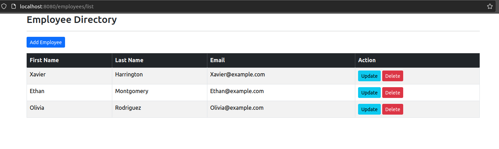

# Table Of Conents
- [Introduction](#introduction)
- [Tech Used](#tech-used)
- [Preview Image](#preview-image)
- [Instructions](#instructions)
  - [Install Mysql](#1-install-mysql)
  - [Create Database User](#2-create-db-user)
  - [Create App User](#3-create-app-users)
  - [Initialize Database](#4-init-database)
  - [Install Dependencies](#5-dependencies)
  - [Serve App](#6-serve-app)
  - [Start App](#7-start-app)

# Introduction
This is a simple App that maintains a list of **Employee** entities. 
Based on the authorization level of the logged user, he can view, add, update or delete employees. 
The access to the app is secured by user authentication.
The passwords are encoded with bcypt and [this site](#https://bcrypt-generator.com/) was used to generate the encryption.
I built the app to familiarize myself with Spring and learn how it functions.
It serves as a hands-on project for me to gain practical experience with the framework, exploring its features and enhancing my skills in Spring development.

# Tech used
- Spring boot for backend 
  - spring-boot-starter-data-jdbc
  - mysql-connector-j
  - spring-boot-starter-security
  - spring-boot-starter-web
- Thymeleaf template engine for frontend visualization
  - spring-boot-starter-thymeleaf
- Bootstrap for css
- Mysql database for storage

# Preview Image


# Instructions
## 1. Install Mysql
Install mysql server
```shell
    sudo apt install mysql-server
```

## 2. Create DB User
Log in as root or other user with sufficient access rights and run the **create-user.sql** script:
```roomsql
-- Drop user first if they exist
DROP USER if exists 'testUser001'@'%' ;

-- Now create user with prop privileges
CREATE USER 'testUser001'@'%' IDENTIFIED BY 'test';

GRANT ALL PRIVILEGES ON * . * TO 'testUser001'@'%';
```

## 3. Create App Users
Create the users with passwords and roles for the app:
```roomsql
USE `employee_directory`;

DROP TABLE IF EXISTS `roles`;
DROP TABLE IF EXISTS `members`;

--
-- Table structure for table `members`
--

CREATE TABLE `members` (
  `user_id` varchar(50) NOT NULL,
  `pw` char(68) NOT NULL,
  `active` tinyint NOT NULL,
  PRIMARY KEY (`user_id`)
) ENGINE=InnoDB DEFAULT CHARSET=latin1;

--
-- Inserting data for table `members`
--
-- NOTE: The passwords are encrypted using BCrypt
--
-- A generation tool is avail at: https://www.luv2code.com/generate-bcrypt-password
--
-- Default passwords here are: fun123
--

INSERT INTO `members`
VALUES
('basic','{bcrypt}$2a$10$wxJTmxwltmwIQ52igLaqa.gqof/C9hfJm2hucga89zD2mY1HVow4K',1),
('manager','{bcrypt}$2a$10$CX4PUBLY4Pl133WvSlV3se8oSi8aTFQtLhFYG1Ja1sNCj8U0QuWjS',1),
('admin','{bcrypt}$2a$10$gfrY6G5.X0nOMvsAzETRJ.CC5ArrV6U52k5bX3Ahkp8/4MKkx1rwa',1);


--
-- Table structure for table `authorities`
--

CREATE TABLE `roles` (
  `user_id` varchar(50) NOT NULL,
  `role` varchar(50) NOT NULL,
  UNIQUE KEY `authorities5_idx_1` (`user_id`,`role`),
  CONSTRAINT `authorities5_ibfk_1` FOREIGN KEY (`user_id`) REFERENCES `members` (`user_id`)
) ENGINE=InnoDB DEFAULT CHARSET=latin1;

--
-- Inserting data for table `roles`
--

INSERT INTO `roles`
VALUES
('basic','ROLE_EMPLOYEE'),
('manager','ROLE_EMPLOYEE'),
('manager','ROLE_MANAGER'),
('admin','ROLE_EMPLOYEE'),
('admin','ROLE_MANAGER'),
('admin','ROLE_ADMIN');
```

## 4. Init Database
Create the database and initialize it with some data, use the **employee-directory.sql** script:
```roomsql
CREATE DATABASE  IF NOT EXISTS `employee_directory`;
USE `employee_directory`;

--
-- Table structure for table `employee`
--

DROP TABLE IF EXISTS `employee`;

CREATE TABLE `employee` (
  `id` int NOT NULL AUTO_INCREMENT,
  `first_name` varchar(255) DEFAULT NULL,
  `last_name` varchar(255) DEFAULT NULL,
  `email` varchar(255) DEFAULT NULL,
  PRIMARY KEY (`id`)
) ENGINE=InnoDB AUTO_INCREMENT=1 DEFAULT CHARSET=latin1;

--
-- Data for table `employee`
--

INSERT INTO `employee` VALUES 
    (1,'Xavier','Harrington','Xavier@example.com'),
    (2,'Olivia','Rodriguez','Olivia@example.com'),
    (3,'Ethan','Montgomery','Ethan@example.com')
```

## 5. Dependencies
Install the maven dependencies
```shell
./mvn install
```
## 6. Serve App
### 6.1 Maven
Serve the spring app in dev mode with, e.g. maven
```shell
./mvnw spring-dev:boot
```
### 6.2 Standard built
Or alternatively build and serve with 
```shell
./src/main/java/com/lbcoding/springboot/thymeleafApp/Main.java
```
file.

## 7. Start App
Use the app on
```text
https://localhost:8080
```
